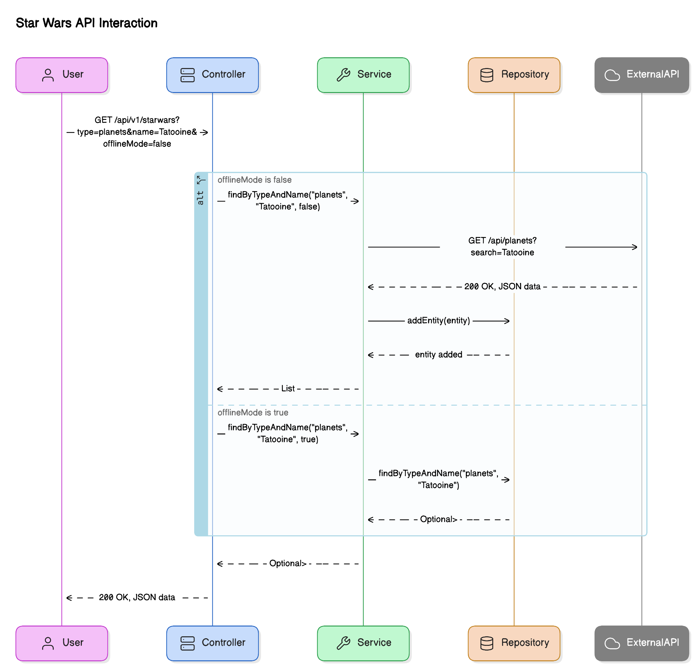

# Star Wars Application

## Overview

The Star Wars application is a Spring Boot-based RESTful API that allows users to retrieve information about various Star Wars entities. It supports filtering by type and name, and can operate in both online and offline modes. The application follows SOLID principles, the 12-Factor App methodology, and implements HATEOAS to ensure maintainability, scalability, and robustness.

## Features

- Retrieve Star Wars entities by type and name.
- Support for online mode (fetching data from external API) and offline mode (fetching data from an in-memory repository).
- HATEOAS support for hypermedia-driven responses.
- Fallback mechanism using Resilience4j circuit breaker.
- Comprehensive logging.

## Prerequisites

- Java 17 or higher
- Maven 3.6.0 or higher
- Docker (optional, for containerization)
- Git (for version control)

## Getting Started

### Clone the Repository

git clone https://github.com/shalinishandilya/starwars.git
cd starwars

## API Endpoints

### Retrieve Star Wars Entities

#### Query Parameters

- `type` (required): The type of Star Wars entity (e.g., planets, people).
- `name` (optional): The name of the entity to search for.
- `offlineMode` (optional): Whether to use offline mode (default is false).

#### Response

- `200 OK`: Successful retrieval of data.
- `400 Bad Request`: Invalid request parameters provided.
- `404 Not Found`: No data found.
- `500 Internal Server Error`: Internal server error.

#### Example Request

GET /api/v1/starwars?type=planets&name=Tatooine&offlineMode=false

### Sequence Diagram

### Design Patterns
- Builder Design Pattern
- Singleton Design Pattern

### Fault Tolerance Mechanism
- Circuit Breaker Pattern

### Jenkins commands
- brew services start jenkins-lts
- brew services restart jenkins-lts
- brew services stop jenkins-lts

### Brew commands
- brew services list

### minikube commands

-  minikube start
-  minikube status 
-  kubectl get nodes
-  kubectl get pods 
-  kubectl get deployments
-  kubectl logs <servicename>
- 